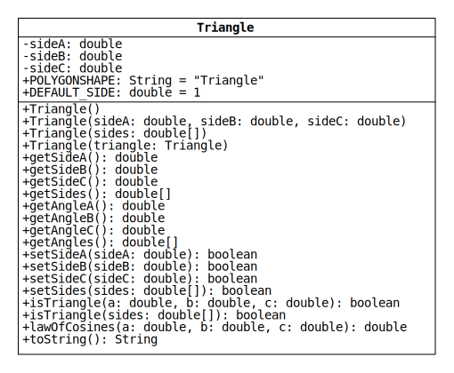

# Lab 2: Encapsulating Triangle Sides

In Lab 1, we implemented a class that consisted of nothing but static methods.
In a typical Java program, classes are not written like this.
Instead, most classes have instance (i.e., non-static) methods and variables.

In this lab, we will write a class named "Triangle" that represents proper triangles.
(A "proper" triangle has positive side lengths and nonzero area.)
To accomplish this, the class will have three double instance variables.
Each object of the class will have its own copy of these variables that it uses to store the side lengths of a particular triangle.

While writing this class, we will contend with the fact that some sets of double values cannot be the lengths of a triangle (e.g., -1, 0, 3).
To ensure that each Triangle object represents an actual triangle, we will use encapsulation to prevent objects from being initialized or changed into invalid states.

## UML Class Diagram

The members of the Triangle class are shown in the UML (unified modeling language) diagram below.

Class diagrams consist of three compartments that contain the following information:

* Top: class name
* Middle: variable names and data types
* Bottom: method signatures and return types

Special notation indicates which variables are constant, which members are static, and the accessibility of all members:

* Variables with uppercase names are constants and should be declared with the final keyword.
* Underlined members are static.
* Plus and minus symbols represent access modifiers.
Plus means that a member is public; minus means that a member is private.

The middle compartment shows that Triangle has three instance variables: `sideA`, `sideB`, and `sideC`.
These variables store the lengths of the sides of a triangle.
Because the variables are non-static, each Triangle object has its own copies.
This allows objects to represent different triangles.

## Method Descriptions

Each of the methods in the bottom compartment of the UML diagram is described below. 
Use these descriptions along with the diagram and JUnit tests to implement the class.

### Constructors

* `Triangle()`: Initialize a new Triangle by assigning `DEFAULT_SIDE` to each instance variable.

* `Triangle(double sideA, double sideB, double sideC)`: Initialize a new Triangle by assigning the given values to the instance variables.
If any of the following conditions is true, assign `DEFAULT_SIDE` to each variable instead:

  * One or more of the values is nonpositive.
  * The values violate the [triangle inequality](https://en.wikipedia.org/wiki/Triangle_inequality#Mathematical_expression_of_the_constraint_on_the_sides_of_a_triangle).

* `Triangle(double[] sides)`: Initialize a new Triangle by assigning the elements of the given array to the instance variables.
Assign element 0 to `sideA`, 1 to `sideB`, and 2 to `sideC`.
If any of the following conditions is true, assign `DEFAULT_SIDE` to each variable instead:

  * The reference given to the method is null.
  * The length of the array is not equal to 3.
  * One or more of the elements is nonpositive.
  * The elements violate the triangle inequality.

* `Triangle(Triangle triangle)`: Initialize a new Triangle by assigning each instance variable of the given Triangle to the corresponding variable of the new Triangle.
(This is known as a "copy constructor.")
If the reference given to the method is null, assign `DEFAULT_SIDE` to each variable instead.

### Side Getters

* `getSideA()`: Return the length of side A.
* `getSideB()`: Return the length of side B.
* `getSideC()`: Return the length of side C.
* `getSides()`: Return an array with the lengths of all three sides in order from A to C.

### Angle Getters

Each of these methods should return angles in units of degrees.

* `getAngleA()`: Return the interior angle that is opposite to side A.
* `getAngleB()`: Return the interior angle that is opposite to side B.
* `getAngleC()`: Return the interior angle that is opposite to side C.
* `getAngles()`: Return an array with the three interior angles in order from A to C.

### Side Setters

* `setSideA(double sideA)`: Assign the given value to `sideA` and return true.
* `setSideB(double sideB)`: Assign the given value to `sideB` and return true.
* `setSideC(double sideB)`: Assign the given value to `sideC` and return true.

For each of the individual side setters (`setSideA`, `setSideB`, `setSideC`), if the given value is nonpositive or the resulting triangle would violate the triangle inequality, the method leaves the object unchanged and returns false.

* `setSides(double[] sides)`: Assign the elements of the given array to the instance variables and return true.
(Assign element 0 to `sideA`, 1 to `sideB`, and 2 to `sideC`.)
If any of the conditions listed below `Triangle(double[] sides)` is true, leave the object unchanged and return false.

### Helper Methods

Use these methods to avoid writing [duplicate code](https://en.wikipedia.org/wiki/Duplicate_code) in the constuctors, side setters, and angle getters.

* `isTriangle(double a, double b, double c)`: 
Return true if the given values are positive and satisfy the [triangle inequality](https://en.wikipedia.org/wiki/Triangle_inequality#Mathematical_expression_of_the_constraint_on_the_sides_of_a_triangle).
Otherwise, return false.

* `isTriangle(double[] sides)`: 
Return true if the given array has three elements that are positive and satisfy the triangle inequality.
Otherwise, return false.
(If the method is given a null reference, return false.)

* `lawOfCosines(double a, double b, double c)`: Use the [law of cosines](https://en.wikipedia.org/wiki/Law_of_cosines) to calculate the interior angle of a triangle with the given side lengths that is opposite to the side with length `c`.

### String Representation

* `toString()`: Return the String `"polygonShape(sideA, sideB, sideC)"` with `polygonShape`, `sideA`, `sideB`, and `sideC` replaced with the values assigned to the variables.
Round each value to 2 decimal places.

There are multiple ways to convert floating-point values to Strings with a given precision.
One of the easiest is to use the [format method](https://docs.oracle.com/en/java/javase/11/docs/api/java.base/java/lang/String.html#format(java.lang.String,java.lang.Object...)) of the String class.
See the JUnit tests for examples.
